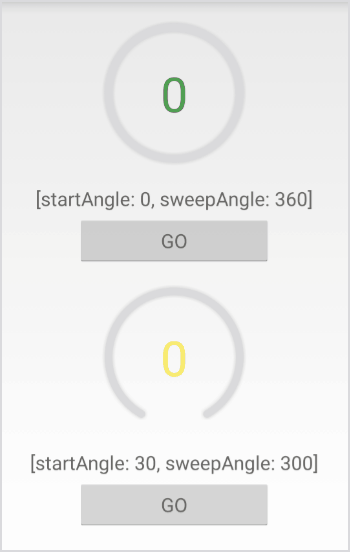

# 

# android-sex-ring [](https://travis-ci.org/dtboy1995/android-sex-ring)
:jack_o_lantern:  a android ring view that can sweep angle

# install
- add to your project gradle file

```gradle
repositories {
    maven { url 'https://jitpack.io' }
}
```
- add to your module gradle file

```gradle
implementation 'com.github.dtboy1995:android-sex-ring:0.2.1'
```

# screenshot

- core usage


- demo gif



# usage
- XML

```xml
<org.ithot.android.view.RingView
        xmlns:app="http://schemas.android.com/apk/res-auto"
        android:layout_width="200dp"
        android:layout_height="200dp"
        android:layout_marginLeft="20dp"
        android:layout_marginTop="20dp"
        app:animateDuration="2000"
        app:animateType="decelerate"
        app:backgroundColor="#DADADE"
        app:foregroundColor="#00BCD3"
        app:shadowColor="#33333333"
        app:shadowEnable="true"
        app:shadowRadius="10"
        app:touchable="true"
        app:startAngle="120"
        app:strokeCap="round"
        app:strokeWidth="8dp"
        app:sweepAngle="300" />
```
- Code

```java
RingView rv = (RingView)findViewById(R.id.ring_view);
// set progress - true is animated
rv.go(20, true);
// set progress callback
rv.setCallback(new AVCallback() {
    @Override
    public void step(int progress) {
      // progress 0~100
      tv.setText(progress + "");
    }
});
// set range mapped progress callback [0, 100] map to => [-20, 30]
rv.setCallback(new AVRangeMapCallback(-20, 30) {
    @Override
    public void step(int progress) {
      // progress -20~30
      tv.setText(progress + "");
    }
});
```

# attrs

name | type | sample |description
:- | :-: | :-:
strokeWidth | `reference`&nbsp;`dimension` | 8dp&nbsp;@dimen/ | the ring width
backgroundColor | `reference`&nbsp;`color` | #DADADE&nbsp;@color/ | the background color of the ring
foregroundColor | `reference`&nbsp;`color` | #00BCD3&nbsp;@color/ | the foreground color of the ring
startAngle | `integer` | 0~360 | the start angle of the ring
animateDuration | `integer` | number | the duration of the animation as the circle changes its progress
sweepAngle | `integer` | 0~360 | the sweep angle of the ring
shadowRadius | `integer` | number | the shadow radius of the ring
onStep | `string`&nbsp;`reference` | onStep&nbsp;@string/ | if not setCallback then you can config onStep (see example)
shadowEnable | `boolean` | true&nbsp;false | shadow enabled
touchable | `boolean` | true&nbsp;false | enable touch control
shadowColor | `reference`&nbsp;`color` | #33333333&nbsp;@color/ | the color of shadow
animateType | `enum` | **linear**&nbsp;**accelerate**&nbsp;**decelerate** | animation interceptor
strokeCap | `enum` | **round**&nbsp;**butt**&nbsp;**square** | paint cap ● round  ▎butt ■ square
