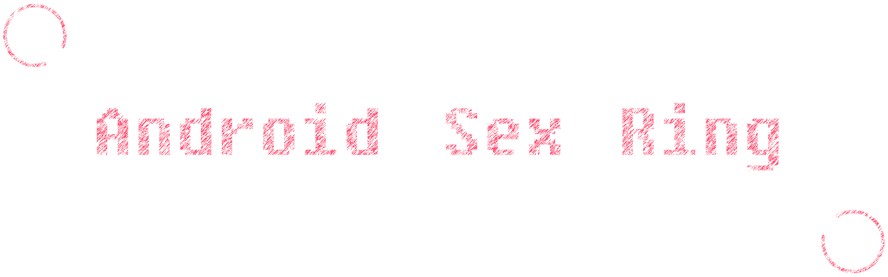

# 

# android-sex-ring [](https://travis-ci.org/dtboy1995/android-sex-ring)
:sailboat: 可以控制角度和范围的圆圈圈

# 安装
```gradle
implementation 'org.ithot.android.view:ring:0.2.3'
```

# 屏幕截图

### 指南

### 例子


# 用法
- XML

```xml
<org.ithot.android.view.RingView
        xmlns:app="http://schemas.android.com/apk/res-auto"
        android:layout_width="200dp"
        android:layout_height="200dp"
        android:layout_marginLeft="20dp"
        android:layout_marginTop="20dp"
        app:animateDuration="2000"
        app:animateType="decelerate"
        app:backgroundColor="#DADADE"
        app:foregroundColor="#00BCD3"
        app:shadowColor="#33333333"
        app:shadowEnable="true"
        app:shadowRadius="10"
        app:touchable="true"
        app:startAngle="120"
        app:strokeCap="round"
        app:strokeWidth="8dp"
        app:sweepAngle="300" />
```
- 代码

```java
RingView rv = (RingView)findViewById(R.id.ring_view);
// 设置进度，第二个参数为是否使用动画
rv.go(20, true);
// 用范围映射去设置进度 比如 20-30 映射到 0-100
rv.go(10, -20, 30, true);
// 进度回调
rv.setCallback(new AVCallback() {
    // 默认返回 0~100
    @Override
    public void step(int progress) {

    }
});
// 用范围映射进度回调
rv.setCallback(new AVRangeMapCallback(-20, 30) {
    // 返回 -20~30
    @Override
    public void step(int progress) {

    }
});
```

# 属性

名称 | 类型 | 例子 | 描述
:- | :-: | :-: | :-
strokeWidth | `reference`&nbsp;`dimension` | 8dp&nbsp;@dimen/ | 圈圈的宽度
backgroundColor | `reference`&nbsp;`color` | #DADADE&nbsp;@color/ |  圈圈背景色
foregroundColor | `reference`&nbsp;`color` | #00BCD3&nbsp;@color/ | 圈圈前景色
startAngle | `integer` | 0~360 |  圈圈起始角度
animateDuration | `integer` | number |  圈圈动画持续总时间
sweepAngle | `integer` | 0~360 |  圈圈滑过的角度
shadowRadius | `integer` | number |  圈圈阴影半径
onStep | `string`&nbsp;`reference` | onStep&nbsp;@string/ | 鸡肋功能
shadowEnable | `boolean` | true&nbsp;false |  圈圈是否开启阴影
touchable | `boolean` | true&nbsp;false |  圈圈是否可触摸
shadowColor | `reference`&nbsp;`color` | #33333333&nbsp;@color/ |  圈圈阴影颜色
animateType | `enum` | **linear**&nbsp;**accelerate**&nbsp;**decelerate** |  圈圈动画插值器
strokeCap | `enum` | **round**&nbsp;**butt**&nbsp;**square** |  圈圈画笔的头儿 ● round  ▎butt ■ square
